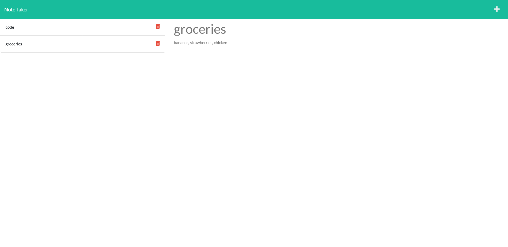

# Module 11 Challenge

## Table of Contents

- [Overview](#overview)
  - [The challenge](#the-challenge)
  - [User Story](#user-story)
  - [Acceptance Criteria](#acceptance-criteria)
  - [Screenshot](#screenshot)
  - [Links](#links)
- [My process](#my-process)
  - [Built with](#built-with)
  - [What I learned](#what-i-learned)
  - [Continued development](#continued-development)
  - [Useful resources](#useful-resources)
- [Author](#author)
- [Acknowledgments](#acknowledgments)
  ​

## Overview

This weeks challenge was to use express and node to make a backend.
​

### The challenge

Create a the backend of a note taking app using express and node.

## User Story

```md
AS A small business owner
I WANT to be able to write and save notes
SO THAT I can organize my thoughts and keep track of tasks I need to complete
```

## Acceptance Criteria

```md
GIVEN a note-taking application
WHEN I open the Note Taker
THEN I am presented with a landing page with a link to a notes page
WHEN I click on the link to the notes page
THEN I am presented with a page with existing notes listed in the left-hand column, plus empty fields to enter a new note title and the note’s text in the right-hand column
WHEN I enter a new note title and the note’s text
THEN a Save icon appears in the navigation at the top of the page
WHEN I click on the Save icon
THEN the new note I have entered is saved and appears in the left-hand column with the other existing notes
WHEN I click on an existing note in the list in the left-hand column
THEN that note appears in the right-hand column
WHEN I click on the Write icon in the navigation at the top of the page
THEN I am presented with empty fields to enter a new note title and the note’s text in the right-hand column
```

### Screenshot



### Links

- Solution URL: [Solution](https://github.com/lafflin/11Express-Note-Taker)
- Live Site: [Heroku](https://express-note-taker-hw11.herokuapp.com/)
  ​

## My process

1. At first I wrote out psuedo code to break the assignment down.
2. After this I installed the necessary packages, and made the server.js file and got it working.
3. I followed this by getting the routes working, getting through the GET's first and the POST last.
4. I then got UUID set up to use for the id's, then deployed to Heroku.
5. I finished by finishing the README and adding some comments

### Built with

- Node.js
- Express.js

### What I learned

- Exercise was good to practice routing and setting up a server

### Continued development

- More work with routing.

### Useful resources

- Google, there was a lot of useful information about how to do the routing and other stuff when I was having issues.

## Author

- Linkedin - [Max McLaughlin](https://www.linkedin.com/in/max-mcla/)

## Acknowledgments

- StackOverflow, TA's, and LA's- As helpful as always
